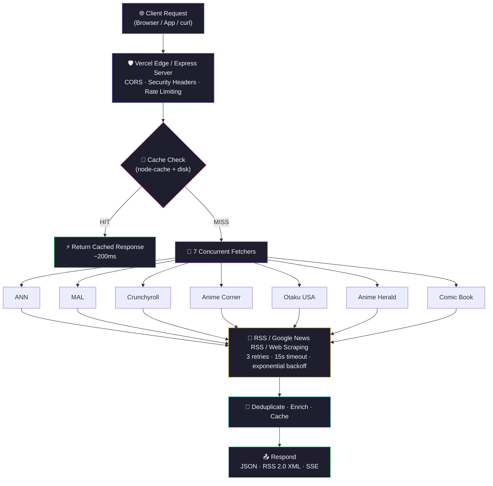
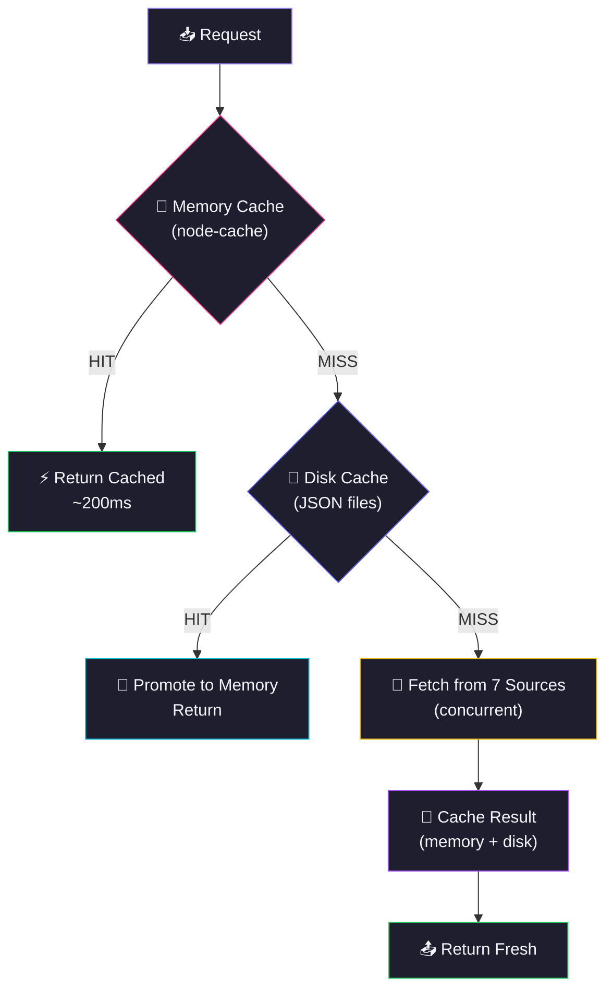

> [!NOTE]
> The Old Deployment URL `https://aninewsapi.vercel.app` Is No Longer Accessible. Use The Current URL: **https://aninews.vercel.app**

<div align="center">
  
  

</div>

<p align="center">
  <a href="https://github.com/Shineii86/AniNewsAPI/stargazers"></a>
  <a href="https://github.com/Shineii86/AniNewsAPI/network/members"></a>
  <a href="https://github.com/Shineii86/AniNewsAPI/issues"></a>
  <a href="https://github.com/Shineii86/AniNewsAPI/pulls"></a>
  <a href="https://github.com/Shineii86/AniNewsAPI/commits"></a>
  <a href="https://github.com/Shineii86/AniNewsAPI/blob/main/LICENSE"></a>
</p>

<p align="center">
  
  
  
  
  
  
  
</p>

<p align="center">
  <b>A serverless API aggregating anime news from 7 sources in real-time.</b><br/>
  Smart caching, keyword search, RSS feeds, date filtering, cursor pagination, and source health monitoring.<br/>
  Built for speed, reliability, and the anime community.
</p>

<p align="center">
  <a href="#-table-of-contents">Table of Contents</a> &bull;
  <a href="#-features">Features</a> &bull;
  <a href="#-api-endpoints">API Docs</a> &bull;
  <a href="#-quick-start">Quick Start</a> &bull;
  <a href="#-deployment">Deployment</a> &bull;
  <a href="#-contributing">Contributing</a>
</p>

---

## 📖 Table of Contents

- [Overview](#-overview)
- [Features](#-features)
- [News Sources](#-news-sources)
- [Tech Stack](#-tech-stack)
- [Architecture](#-architecture)
- [Project Structure](#-project-structure)
- [Quick Start](#-quick-start)
- [Configuration](#-configuration)
- [API Endpoints](#-api-endpoints)
- [API Response Schema](#-api-response-schema)
- [Deployment](#-deployment)
- [Available Scripts](#-available-scripts)
- [Performance](#-performance)
- [Changelog Highlights](#-changelog-highlights)
- [Troubleshooting](#-troubleshooting)
- [FAQ](#-faq)
- [Roadmap](#-roadmap)
- [Contributing](#-contributing)
- [Acknowledgements](#-acknowledgements)
- [License](#-license)
- [Author](#-author)
- [Star History](#-star-history)

---

## 🌸 Overview

**AniNewsAPI** is a serverless anime news aggregation API that scrapes, deduplicates, and serves articles from **7 major anime news sources** — all through a clean REST API with zero database setup.

> 💡 No database, no auth for reads, no complex setup. Just deploy to Vercel and you have a production API.

### Why AniNewsAPI?

- 📰 **7 Sources** — ANN, MAL, Crunchyroll, Anime Corner, Otaku USA, Anime Herald, Comic Book
- ⚡ **Smart Caching** — Two-tier cache (memory + disk) with 10-minute TTL, survives serverless cold starts
- 🔍 **Full-Text Search** — Relevance-scored search across titles, excerpts, sources, and tags
- 🗞️ **RSS Feeds** — Standards-compliant RSS 2.0 for any feed reader
- 📄 **Full Article Extraction** — Get readable article content by slug
- 🏷️ **Tag Filtering** — Browse articles by tag with count aggregation
- 📊 **Source Health** — Real-time per-source health checks, latency, and article counts
- 🔒 **CORS Enabled** — Works from any frontend, no proxy needed
- 🚀 **Zero-Config Deploy** — One click to Vercel, or run standalone with Express

### How It Works



---

## ✨ Features

<table>
  <tr>
    <td>

### ⚡ Core
- **Real-time scraping** from 7 anime news sources
- **Smart caching** with 10-minute TTL + disk backup
- **Concurrent fetching** — all sources hit simultaneously
- **Retry logic** — 3 attempts per source with exponential backoff
- **Graceful degradation** — if a source fails, others continue
- **Google News RSS proxy** for Cloudflare-protected sources

    </td>
    <td>

### 🔍 Data
- **Keyword search** with relevance scoring (`/api/search`)
- **Date range filtering** — `?from=YYYY-MM-DD&to=YYYY-MM-DD`
- **Cursor pagination** — opaque `nextCursor` for efficient paging
- **RSS 2.0 feed** for readers & integrations (`/api/rss`)
- **Full article extraction** by slug (`/api/news/:slug`)
- **Tag filtering** with article counts (`/api/news/tags`)

    </td>
  </tr>
  <tr>
    <td>

### 🛡️ Reliability
- **RSS fallback** when web scraping is blocked
- **Cross-source deduplication** by normalized title
- **Timeout protection** — 15s per source, never hangs
- **CORS enabled** — works from any frontend
- **Security headers** — X-Frame-Options, X-Content-Type-Options
- **Rate limiting** — 100 req/min per IP with headers

    </td>
    <td>

### 📊 Monitoring
- **Source health** — per-source status, article count, latency (`/api/sources`)
- **Cache statistics** — hit/miss metrics (`/api/stats`)
- **Health check** — uptime, version, node info (`/api/health`)
- **Cache clear auth** — API key protected (`CACHE_CLEAR_KEY` env)
- **OpenAPI 3.0.3 spec** — machine-readable API definition

    </td>
  </tr>
</table>

### 🌟 Feature Highlights

| Feature | Description | Status |
|:---|:---|:---:|
| 📰 7 News Sources | ANN, MAL, Crunchyroll, Anime Corner, Otaku USA, Anime Herald, Comic Book | ✅ |
| ⚡ Smart Caching | Two-tier (memory + disk) with 10-min TTL | ✅ |
| 🔍 Full-Text Search | Relevance scoring — title (10pts) vs excerpt (3pts) | ✅ |
| 📄 Article Extraction | Full content parsing from original URLs | ✅ |
| 🗞️ RSS 2.0 Feed | Standards-compliant XML with media:thumbnail | ✅ |
| 📅 Date Filtering | `?from=YYYY-MM-DD&to=YYYY-MM-DD` on news & search | ✅ |
| 🔄 Cursor Pagination | Opaque base64url cursors for stable paging | ✅ |
| 🏷️ Tag System | Tag listing with counts, filter by tag | ✅ |
| 📊 Source Health | Real-time fetch status, latency, article counts | ✅ |
| 🔒 Cache Auth | API key protection for cache clear endpoint | ✅ |
| 📡 SSE Stream | Server-Sent Events for real-time push | ✅ |
| 📋 OpenAPI Spec | Machine-readable 3.0.3 specification | ✅ |
| 🚀 One-Click Deploy | Vercel button deployment | ✅ |
| 🏗️ Express Mode | Standalone server with `npm start` | ✅ |

---

## 🗞️ News Sources

| Source | Key | Method | Articles | Website |
|:---|:---|:---|:---|:---|
| **Anime News Network** | `ann` | Google News RSS | ~15 | [animenewsnetwork.com](https://www.animenewsnetwork.com/) |
| **Anime Corner** | `animecorner` | RSS Feed | ~12 | [animecorner.me](https://animecorner.me/) |
| **MyAnimeList** | `myanimelist` | Direct Scraping | ~15 | [myanimelist.net](https://myanimelist.net/) |
| **Otaku USA Magazine** | `otakuusa` | Google News RSS | ~12 | [otakuusamagazine.com](https://otakuusamagazine.com/) |
| **Crunchyroll** | `crunchyroll` | Google News RSS | ~15 | [crunchyroll.com/news](https://www.crunchyroll.com/news) |
| **Anime Herald** | `animeherald` | RSS Feed | ~10 | [animeherald.com](https://www.animeherald.com/) |
| **Comic Book** | `comicbook` | Direct Scraping | ~10 | [comicbook.com/anime](https://comicbook.com/anime/) |

> **Total: 60+ unique articles** after cross-source deduplication

### Adding a New Source

1. Create `utils/fetchNewSource.js` — export async function returning `[{ title, slug, source, excerpt, date, image, link, tags }]`
2. Register in `utils/sources.js` → `SOURCES` object
3. Test with `npm test`, submit a PR

---

## 🛠️ Tech Stack

| Technology | Purpose | Version | Documentation |
|:---|:---|:---|:---|
| 🟢 [Node.js](https://nodejs.org/) | JavaScript runtime | >= 20 | [Docs](https://nodejs.org/docs/) |
| ⚡ [Express](https://expressjs.com/) | HTTP server framework | 5.1 | [Docs](https://expressjs.com/en/5x/api.html) |
| ▲ [Vercel Functions](https://vercel.com/docs/functions) | Serverless deployment | — | [Docs](https://vercel.com/docs/functions) |
| 🔍 [Cheerio](https://cheerio.js.org/) | HTML parsing & scraping | 1.0 | [Docs](https://cheerio.js.org/docs/) |
| 🌐 [Axios](https://axios-http.com/) | HTTP client | 1.7 | [Docs](https://axios-http.com/docs/intro) |
| 📡 [rss-parser](https://github.com/rbren/rss-parser) | RSS/Atom feed parsing | 3.13 | [Docs](https://github.com/rbren/rss-parser) |
| 💾 [node-cache](https://github.com/ptarjan/node-cache) | In-memory caching | 5.1 | [Docs](https://github.com/ptarjan/node-cache) |
| 🔤 [he](https://github.com/mathiasbynens/he) | HTML entity decoding | 1.2 | [Docs](https://github.com/mathiasbynens/he) |

### 📦 Key Dependencies

```json
{
  "express": "^5.1.0",        // HTTP server
  "axios": "^1.7.2",          // HTTP client for scraping
  "cheerio": "^1.0.0-rc.12",  // HTML parsing
  "rss-parser": "^3.13.0",    // RSS feed parsing
  "node-cache": "^5.1.2",     // In-memory cache
  "he": "^1.2.0"              // HTML entity decoding
}
```

---

## 🏗️ Architecture

### Request Flow

| Stage | Component | Description |
|:-----:|-----------|-------------|
| 1 | **Client** | Browser, app, or `curl` sends request |
| 2 | **Vercel Edge / Express** | Routes request, applies CORS + security headers + rate limit |
| 3 | **Cache Check** | `node-cache` with 10-min TTL — hit = instant response |
| 4 | **Fetch Sources** | 7 concurrent scrapers (3 retries each, 15s timeout) |
| 5 | **Deduplicate** | Cross-source dedup by normalized title |
| 6 | **Enrich & Respond** | Filter, paginate, sort, format → JSON/RSS/SSE |

### Caching Architecture



> 💡 Serverless functions have read-only filesystems except `/tmp`. The disk cache writes to `/tmp` on Vercel, surviving across warm invocations.

### Source Fetch Strategy

| Source | Primary | Fallback | Notes |
|:---|:---|:---|:---|
| ANN | Google News RSS | Direct scraping | Cloudflare blocks direct access |
| Anime Corner | RSS Feed | Direct scraping | RSS has real descriptions |
| MyAnimeList | Direct scraping | Page 2 scraping | Custom date format parser |
| Otaku USA | Google News RSS | Direct scraping | 520 errors on direct access |
| Crunchyroll | Google News RSS | Direct scraping | Blocks direct scraping |
| Anime Herald | RSS Feed | Direct scraping | RSS has real descriptions |
| Comic Book | Direct scraping | RSS Feed | Uses subheadline selector |

---

## 📁 Project Structure

```
AniNewsAPI/
├── 📂 api/                            # 🌐 Vercel serverless functions
│   ├── 📂 cache/
│   │   └── 📄 clear.js                #    🔐 Cache management (API key protected)
│   ├── 📄 health.js                   #    💚 Health check endpoint
│   ├── 📄 news.js                     #    📰 Main news endpoint (pagination, filtering)
│   ├── 📂 news/
│   │   ├── 📄 [slug].js               #    📄 Full article by slug
│   │   └── 📄 tags.js                 #    🏷️ Tag listing & filtering
│   ├── 📄 openapi.js                  #    📋 OpenAPI 3.0.3 specification
│   ├── 📄 rss.js                      #    🗞️ RSS 2.0 XML feed
│   ├── 📄 search.js                   #    🔍 Full-text search with scoring
│   ├── 📄 sources.js                  #    📊 Per-source health & stats
│   ├── 📄 stats.js                    #    📈 Cache hit/miss statistics
│   └── 📄 stream.js                   #    📡 Server-Sent Events
│
├── 📂 public/
│   ├── 📄 index.html                  #    🏠 Landing page
│   ├── 📄 manifest.json               #    📱 PWA manifest
│   ├── 📄 og-image.png                #    🖼️ Open Graph image
│   └── 📄 og-image.svg                #    🖼️ Open Graph vector
│
├── 📂 utils/                          # ⚙️ Core logic
│   ├── 📄 cacheHandler.js             #    💾 Two-tier cache (memory + disk)
│   ├── 📄 constants.js                #    📌 Shared config & defaults
│   ├── 📄 contentParser.js            #    📄 Full-article content extraction
│   ├── 📄 dateParser.js               #    📅 Multi-format date parsing
│   ├── 📄 fetchANN.js                 #    📰 Anime News Network fetcher
│   ├── 📄 fetchAnimeCorner.js         #    📰 Anime Corner fetcher
│   ├── 📄 fetchAnimeHerald.js         #    📰 Anime Herald fetcher
│   ├── 📄 fetchComicBook.js           #    📰 Comic Book fetcher
│   ├── 📄 fetchCrunchyroll.js         #    📰 Crunchyroll fetcher
│   ├── 📄 fetchMyAnimeList.js         #    📰 MyAnimeList fetcher
│   ├── 📄 fetchOtakuNews.js           #    📰 Otaku USA fetcher
│   ├── 📄 generateSlug.js             #    🔗 URL-safe slug generator
│   └── 📄 sources.js                  #    📋 Centralized source registry
│
├── 📂 data/                           # 💾 Disk cache files (auto-generated)
│
├── 📄 server.js                       # 🚀 Express server entry point
├── 📄 index.js                        # ▲ Vercel serverless entry point
├── 📄 test.js                         # 🧪 Integration test suite
├── 📄 vercel.json                     # ▲ Vercel routing & headers config
├── 📄 package.json                    # 📦 Dependencies & scripts
├── 📄 CHANGELOG.md                    # 📝 Version history
├── 📄 CONTRIBUTING.md                 # 🤝 Contribution guidelines
├── 📄 LICENSE                         # 📜 MIT License
└── 📄 README.md                       # 📖 This file
```

---

## 🚀 Quick Start

### Prerequisites

| Requirement | Minimum | Recommended |
|:---|:---|:---|
| 📦 Node.js | 20.x | 20.x LTS |
| 📦 npm | 9.0+ | 10.x |
| 💻 OS | Windows, macOS, Linux | Any |

### 🔧 Installation

```bash
# 1️⃣ Clone the repository
git clone https://github.com/Shineii86/AniNewsAPI.git
cd AniNewsAPI

# 2️⃣ Install dependencies
npm install

# 3️⃣ Start development server
npm run dev
```

> 🌐 Open [http://localhost:3000](http://localhost:3000) in your browser.

### 🏗️ Build for Production

```bash
# Start production server
npm start

# Run tests
npm test
```

### 🐳 Alternative Package Managers

```bash
# Using yarn
yarn install
yarn dev

# Using pnpm
pnpm install
pnpm dev

# Using bun
bun install
bun dev
```

---

## ⚙️ Configuration

### Environment Variables

| Variable | Default | Description |
|:---|:---|:---|
| `CACHE_TTL` | `600` | Cache duration in seconds (10 minutes) |
| `PORT` | `3000` | Server port (Express mode only) |
| `CACHE_CLEAR_KEY` | — | API key for `POST /api/cache/clear` (optional) |
| `API_URL` | `http://localhost:3000` | Base URL for test suite |

### Vercel Configuration

The `vercel.json` file handles:
- **Rewrites** — Maps clean URLs to serverless functions
- **Headers** — CORS, caching, and rate limit headers
- **Environment** — Sets `CACHE_TTL` for production

---

## 📡 API Endpoints

### `GET /api/news`

Latest anime news from all or specific sources.

| Param | Type | Default | Description |
|:---|:---|:---|:---|
| `limit` | `1-100` | `20` | Max articles per page |
| `offset` | `>=0` | `0` | Pagination offset |
| `cursor` | `string` | — | Pagination cursor (from `meta.nextCursor`) |
| `sort` | `latest\|oldest` | `latest` | Sort order |
| `source` | `string` | `all` | Filter by source key |
| `from` | `YYYY-MM-DD` | — | Start date filter |
| `to` | `YYYY-MM-DD` | — | End date filter |
| `refresh` | `boolean` | `false` | Bypass cache |

```bash
# Basic usage
curl "https://aninews.vercel.app/api/news?limit=10"

# Filter by source with pagination
curl "https://aninews.vercel.app/api/news?source=crunchyroll&limit=10&offset=10"

# Date range filtering
curl "https://aninews.vercel.app/api/news?from=2026-05-20&to=2026-05-27"

# Cursor-based pagination (use nextCursor from previous response)
curl "https://aninews.vercel.app/api/news?limit=20&cursor=eyJvZmZzZXQiOjIwfQ"
```

<details>
<summary>📄 Example Response</summary>

```json
{
  "success": true,
  "data": [
    {
      "title": "Demon Slayer Season 4 Announced",
      "slug": "ann-demon-slayer-season-4-announced",
      "source": "Anime News Network",
      "excerpt": "The official website confirmed...",
      "date": "2026-05-27T10:30:00.000Z",
      "image": "https://example.com/image.jpg",
      "link": "https://www.animenewsnetwork.com/news/...",
      "tags": ["news", "anime"]
    }
  ],
  "meta": {
    "total": 62,
    "returned": 10,
    "offset": 0,
    "limit": 10,
    "hasMore": true,
    "nextCursor": "eyJvZmZzZXQiOjEwfQ",
    "source": "all",
    "sort": "latest",
    "from": "2026-05-20",
    "to": "2026-05-27",
    "responseTime": "234ms",
    "timestamp": "2026-05-27T12:00:00.000Z"
  }
}
```
</details>

---

### `GET /api/search`

Full-text search with relevance scoring. Title matches rank higher than excerpt matches.

| Param | Required | Description |
|:---|:---|:---|
| `q` | Yes | Search query (min 2 chars) |
| `source` | No | Filter by source key |
| `limit` | No | Max results (1-100) |
| `offset` | No | Pagination offset |
| `from` | No | Start date (YYYY-MM-DD) |
| `to` | No | End date (YYYY-MM-DD) |

**Scoring Algorithm:**
- Title match: **+10 points** per search term
- Excerpt match: **+3 points** per search term
- Tiebreaker: newest date first

```bash
curl "https://aninews.vercel.app/api/search?q=demon+slayer"
curl "https://aninews.vercel.app/api/search?q=manga&source=ann&limit=5"
curl "https://aninews.vercel.app/api/search?q=crunchyroll&from=2026-05-20&to=2026-05-27"
```

---

### `GET /api/news/tags`

List available tags with article counts, or filter articles by tag.

```bash
# List all tags with counts
curl "https://aninews.vercel.app/api/news/tags"

# Filter articles by tag
curl "https://aninews.vercel.app/api/news/tags?tag=official"

# Filter by tag and source
curl "https://aninews.vercel.app/api/news/tags?tag=news&source=ann"
```

<details>
<summary>📄 Example Response (tag listing)</summary>

```json
{
  "success": true,
  "data": {
    "tags": [
      { "name": "anime", "count": 45 },
      { "name": "news", "count": 38 },
      { "name": "official", "count": 22 }
    ],
    "totalTags": 15,
    "totalArticles": 62
  },
  "meta": { "timestamp": "2026-05-27T12:00:00.000Z" }
}
```
</details>

---

### `GET /api/news/:slug`

Full article content extraction from the original URL.

```bash
curl "https://aninews.vercel.app/api/news/ann-demon-slayer-season-4-announced"
```

<details>
<summary>📄 Example Response</summary>

```json
{
  "success": true,
  "data": {
    "title": "Demon Slayer Season 4 Announced",
    "slug": "ann-demon-slayer-season-4-announced",
    "source": "Anime News Network",
    "excerpt": "The official website confirmed...",
    "date": "2026-05-27T10:30:00.000Z",
    "link": "https://www.animenewsnetwork.com/news/...",
    "content": "<p>Full article HTML content...</p>",
    "author": "John Doe",
    "publishDate": "2026-05-27"
  },
  "meta": { "cached": false, "timestamp": "2026-05-27T12:00:00.000Z" }
}
```
</details>

---

### `GET /api/rss`

Standards-compliant RSS 2.0 XML feed. Works with any feed reader.

| Param | Default | Description |
|:---|:---|:---|
| `source` | `all` | Filter by source |
| `limit` | `20` | Max items |

```bash
curl "https://aninews.vercel.app/api/rss"
curl "https://aninews.vercel.app/api/rss?source=crunchyroll&limit=10"
```

---

### `GET /api/sources`

Per-source health monitoring. Returns fetch status, article counts, and latency.

```bash
curl "https://aninews.vercel.app/api/sources"
```

<details>
<summary>📄 Example Response</summary>

```json
{
  "success": true,
  "data": [
    {
      "key": "ann",
      "name": "Anime News Network",
      "status": "healthy",
      "articleCount": 15,
      "latency": "1234ms",
      "lastFetch": "2026-05-27T12:00:00.000Z",
      "lastError": null
    },
    {
      "key": "crunchyroll",
      "name": "Crunchyroll",
      "status": "degraded",
      "articleCount": 0,
      "latency": "15001ms",
      "lastFetch": "2026-05-27T11:55:00.000Z",
      "lastError": { "message": "Timeout", "time": "2026-05-27T11:55:00.000Z" }
    }
  ],
  "meta": {
    "total": 7,
    "healthy": 6,
    "degraded": 1,
    "responseTime": "2345ms"
  }
}
```
</details>

---

### `GET /api/health` · `GET /api/stats`

Health check and cache statistics.

```bash
curl "https://aninews.vercel.app/api/health"
curl "https://aninews.vercel.app/api/stats"
```

---

### `POST /api/cache/clear`

Manual cache flush. Requires API key when `CACHE_CLEAR_KEY` is set.

```bash
# Clear all caches
curl -X POST "https://aninews.vercel.app/api/cache/clear" \
  -H "X-Api-Key: your-secret-key"

# Clear specific cache key
curl -X POST "https://aninews.vercel.app/api/cache/clear" \
  -H "Content-Type: application/json" \
  -H "X-Api-Key: your-secret-key" \
  -d '{"key": "news_all"}'
```

---

### `GET /api/stream`

Server-Sent Events stream. Sends an initial burst of status data then closes.

```bash
curl -N "https://aninews.vercel.app/api/stream"
```

> ⚠️ Vercel Hobby functions timeout at 10s. This endpoint sends a single burst and closes. For real-time updates, poll `/api/news?refresh=true`.

---

### `GET /api/openapi`

OpenAPI 3.0.3 specification in JSON format. Use with Swagger UI, Postman, or any OpenAPI-compatible tool.

```bash
curl "https://aninews.vercel.app/api/openapi"
```

---

## 📋 API Response Schema

### Article Object

| Field | Type | Description | Example |
|:---|:---|:---|:---|
| `title` | `string` | Article headline | `"Demon Slayer Season 4"` |
| `slug` | `string` | URL-safe identifier | `"ann-demon-slayer-season-4"` |
| `source` | `string` | Display name of source | `"Anime News Network"` |
| `excerpt` | `string` | Article description/summary | `"The official website..."` |
| `date` | `string` | ISO 8601 publish date | `"2026-05-27T10:30:00.000Z"` |
| `image` | `string` | Thumbnail URL | `"https://..."` |
| `link` | `string` | Original article URL | `"https://..."` |
| `tags` | `string[]` | Category tags | `["news", "anime"]` |

### Pagination Meta

| Field | Type | Description |
|:---|:---|:---|
| `total` | `number` | Total matching articles |
| `returned` | `number` | Articles in this response |
| `offset` | `number` | Current offset |
| `limit` | `number` | Page size |
| `hasMore` | `boolean` | Whether more pages exist |
| `nextCursor` | `string\|null` | Opaque cursor for next page |
| `source` | `string` | Source filter applied |
| `sort` | `string` | Sort order applied |
| `responseTime` | `string` | Server processing time |

---

## 🌐 Deployment

### ▲ Vercel (Recommended)

[](https://vercel.com/new/clone?repository-url=https://github.com/Shineii86/AniNewsAPI)

1. Click the button above (or import manually on vercel.com)
2. Vercel auto-detects the project — **no config needed**
3. Your API is live! 🎉

```bash
# Or use Vercel CLI
npx vercel --prod
```

### 🖥️ Standalone Server

```bash
# Clone and install
git clone https://github.com/Shineii86/AniNewsAPI.git
cd AniNewsAPI && npm install

# Start production server
npm start
# → http://localhost:3000
```

### 🐳 Docker

```dockerfile
FROM node:20-alpine
WORKDIR /app
COPY package*.json ./
RUN npm ci --production
COPY . .
EXPOSE 3000
CMD ["node", "server.js"]
```

---

## 📜 Available Scripts

| Command | Description | Details |
|:---|:---|:---|
| `npm run dev` | 🔥 Start development server | Runs on `localhost:3000` |
| `npm start` | 🚀 Start production server | `NODE_ENV=production node server.js` |
| `npm test` | 🧪 Run integration tests | Tests all 12 endpoints |
| `npm run build` | 📦 Build (no-op for serverless) | Vercel handles this |

---

## ⚡ Performance

| Metric | Value |
|:---|:---|
| ⚡ Cached response | ~200ms |
| 🔄 Fresh fetch (all 7 sources) | ~3-6s |
| 💾 Cache TTL | 10 minutes |
| 🔁 Retry attempts | 3 per source |
| ⏱️ Timeout per source | 15 seconds |
| 📰 Total articles (avg) | 60+ after dedup |
| 📦 Total codebase | ~50KB |

### Optimization Features

- 💾 **Two-tier cache** — Memory-first with disk fallback
- ⚡ **Concurrent fetching** — All 7 sources hit simultaneously
- 🔄 **Exponential backoff** — 1s, 2s, 3s delays on retry
- 🧹 **Auto-cleanup** — Stale rate limit buckets purged every 5 min
- 📁 **Disk persistence** — Source metrics survive serverless cold starts
- 🗜️ **Minimal deps** — Only 6 production dependencies

---

## 📝 Changelog Highlights

| Version | Date | Key Changes |
|:---|:---|:---|
| **4.2.0** | 2026-05-28 | Code style overhaul — AlisaReactionBot-style documentation across all 26 files |
| **4.1.6** | 2026-05-27 | Full excerpts, no truncation — removed 200-char limit from all 7 fetchers |
| **4.1.5** | 2026-05-27 | Real excerpts for Comic Book, Anime Corner, Anime Herald |
| **4.1.4** | 2026-05-27 | Sources endpoint now does live health checks |
| **4.1.3** | 2026-05-27 | Persist source metrics to disk for serverless survival |
| **4.1.0** | 2026-05-26 | Date range filtering, cursor pagination, search scoring |

> 📝 See [CHANGELOG.md](./CHANGELOG.md) for the full version history.

---

## 🔧 Troubleshooting

| Problem | Cause | Solution |
|:---|:---|:---|
| ❌ `npm install` fails | Node.js version too old | Upgrade to Node.js 20+ (`node -v`) |
| ❌ No articles returned | All sources down | Check `/api/sources` for health status |
| ❌ Cache always empty | Serverless cold start | Normal — first request after idle is slow |
| ❌ Rate limited (429) | Exceeded 100 req/min | Wait for `X-RateLimit-Reset` seconds |
| ❌ CORS errors | Frontend domain blocked | CORS is `*` — check browser extension |
| ❌ RSS feed empty | No cached articles | Hit `/api/news` first to populate cache |
| ❌ Article content empty | Source blocked parsing | Falls back to "View original article" link |
| ❌ 404 on API routes | Wrong URL format | Use `/api/news` not `/news` |
| ❌ Deploy fails on Vercel | Build error | Check `npm run build` locally first |
| ❌ Tests failing | Server not running | Start server first with `npm run dev` |

### 🐛 Debug Mode

```bash
# Run with verbose logging
NODE_ENV=development npm run dev

# Run tests against local server
API_URL=http://localhost:3000 npm test

# Check cache state
curl http://localhost:3000/api/stats
curl http://localhost:3000/api/health
```

---

## ❓ FAQ

<details>
<summary><b>📰 How do I add a new news source?</b></summary>
<br/>
1. Create <code>utils/fetchNewSource.js</code> exporting an async function that returns an array of article objects: <code>[{ title, slug, source, excerpt, date, image, link, tags }]</code><br/>
2. Register it in <code>utils/sources.js</code> — add an import and entry to the <code>SOURCES</code> object<br/>
3. Run <code>npm test</code> to verify, then submit a PR
</details>

<details>
<summary><b>🔄 How often does the data refresh?</b></summary>
<br/>
The cache TTL is 10 minutes by default. After that, the next request triggers a fresh fetch from all 7 sources. You can force a refresh with <code>?refresh=true</code> or change the TTL with the <code>CACHE_TTL</code> environment variable.
</details>

<details>
<summary><b>📡 Can I use this in my frontend app?</b></summary>
<br/>
Yes! CORS is enabled for all origins (<code>*</code>). Just make fetch requests to the API endpoints. No API key needed for read operations. Example: <code>fetch('https://aninews.vercel.app/api/news?limit=10')</code>
</details>

<details>
<summary><b>🗞️ How do I subscribe to the RSS feed?</b></summary>
<br/>
Add <code>https://aninews.vercel.app/api/rss</code> to any feed reader (Feedly, Inoreader, NetNewsWire, etc.). You can filter by source: <code>/api/rss?source=crunchyroll</code>
</details>

<details>
<summary><b>📊 How does deduplication work?</b></summary>
<br/>
Articles are deduplicated by normalized title — punctuation is stripped, whitespace is collapsed, and compared case-insensitively. The first occurrence (from the source that responded fastest) wins.
</details>

<details>
<summary><b>🔒 Is the cache clear endpoint secure?</b></summary>
<br/>
When <code>CACHE_CLEAR_KEY</code> is set, the endpoint requires an <code>X-Api-Key</code> header. Without the env var, the endpoint is open — so set it in production. Read endpoints (<code>/api/news</code>, etc.) are always open.
</details>

<details>
<summary><b>⏱️ Why is the first request slow?</b></summary>
<br/>
On serverless (Vercel), the first request after idle triggers a "cold start" — the function initializes and fetches from all 7 sources (~3-6s). Subsequent requests hit the cache (~200ms). Warm functions stay alive for ~5 minutes.
</details>

<details>
<summary><b>🌐 Can I self-host this?</b></summary>
<br/>
Yes! Use <code>npm start</code> to run the Express server on any VPS, Docker container, or PaaS. The Vercel serverless functions are optional — <code>server.js</code> handles everything.
</details>

---

## 🗺️ Roadmap

### 🎯 Planned Features

- [ ] 🔐 **API key authentication** — Per-user rate limits and usage tracking
- [ ] 📊 **Admin dashboard** — Web UI for cache management and source monitoring
- [ ] 🌙 **Dark/light mode** — Theme toggle for the landing page
- [ ] 📱 **PWA support** — Install as app on mobile devices
- [ ] 🔔 **Webhook notifications** — Push new articles to Discord/Slack
- [ ] 📈 **Analytics** — Track popular endpoints and search queries
- [ ] 🗄️ **Database option** — Optional Supabase/Postgres for persistence
- [ ] 🌐 **Multi-language** — Support for Japanese, Korean news sources
- [ ] 🤖 **AI summaries** — Auto-generate article summaries
- [ ] 📦 **NPM package** — Client SDK for easy integration

### ✅ Completed

- [x] 📰 7 news sources with concurrent fetching
- [x] 💾 Two-tier caching (memory + disk)
- [x] 🔍 Full-text search with relevance scoring
- [x] 📅 Date range filtering
- [x] 🔄 Cursor-based pagination
- [x] 🗞️ RSS 2.0 feed
- [x] 📄 Full article extraction
- [x] 🏷️ Tag filtering with counts
- [x] 📊 Source health monitoring
- [x] 📋 OpenAPI 3.0.3 specification
- [x] 📡 SSE stream
- [x] 🔒 Cache clear authentication
- [x] 🚀 One-click Vercel deployment
- [x] 📖 Comprehensive documentation

---

## 🤝 Contributing

*Contributions are welcome and appreciated! Here's how you can help:*

<table>
<tr>
<td width="25%" align="center">

### 🐛 Report Bugs
Found something broken?

[Open an Issue](https://github.com/Shineii86/AniNewsAPI/issues)

</td>
<td width="25%" align="center">

### 💡 Suggest Features
Have an idea for the notebook?

[Start a Discussion](https://github.com/Shineii86/AniNewsAPI/issues)

</td>
<td width="25%" align="center">

### 🔀 Submit PRs
Ready to contribute code?

[Fork & Submit](https://github.com/Shineii86/AniNewsAPI/fork)

</td>
</tr>
</table>

### 🔄 How to Contribute

```bash
# 1️⃣ Fork the repository
# Click the "Fork" button on GitHub

# 2️⃣ Clone your fork
git clone https://github.com/YOUR_USERNAME/AniNewsAPI.git
cd AniNewsAPI

# 3️⃣ Create a feature branch
git checkout -b feature/amazing-feature

# 4️⃣ Make your changes
# Edit files, add features, fix bugs...

# 5️⃣ Test your changes
npm test

# 6️⃣ Commit your changes
git commit -m 'feat: add amazing feature'

# 7️⃣ Push to your fork
git push origin feature/amazing-feature

# 8️⃣ Open a Pull Request
# Go to GitHub and create a PR
```

### 📋 Guidelines

- ✅ Follow the existing code style and documentation conventions
- ✅ Write meaningful commit messages (use [conventional commits](https://www.conventionalcommits.org/))
- ✅ Run `npm test` before submitting
- ✅ Update CHANGELOG.md with your changes
- ✅ Keep PRs focused — one feature or fix per PR
- ✅ Add JSDoc comments for new functions
- ❌ Don't commit `node_modules` or cache files
- ❌ Don't add unrelated changes to a single PR

### 🐛 Reporting Bugs

1. Check existing [issues](https://github.com/Shineii86/AniNewsAPI/issues) first
2. Create a new issue with:
   - Clear title and description
   - Steps to reproduce
   - Expected vs actual behavior
   - API endpoint and parameters used

### 💡 Suggesting Features

1. Check the [Roadmap](#-roadmap) for planned features
2. Open a [feature request](https://github.com/Shineii86/AniNewsAPI/issues/new) with:
   - Clear description of the feature
   - Use case / motivation
   - Example API usage if applicable

---

## 🙏 Acknowledgements

### 📰 News Sources

| Source | About |
|:---|:---|
| [Anime News Network](https://www.animenewsnetwork.com/) | Industry-leading anime journalism |
| [Anime Corner](https://animecorner.me/) | Community-driven anime news & polls |
| [MyAnimeList](https://myanimelist.net/) | The largest anime/manga database |
| [Otaku USA Magazine](https://otakuusamagazine.com/) | English-language anime culture magazine |
| [Crunchyroll](https://www.crunchyroll.com/news) | Official streaming platform news |
| [Anime Herald](https://www.animeherald.com/) | Anime news, reviews & editorials |
| [Comic Book](https://comicbook.com/anime/) | Anime & manga coverage at ComicBook |

### 🛠️ Technologies

- **[Express](https://expressjs.com/)** — Fast, unopinionated web framework
- **[Cheerio](https://cheerio.js.org/)** — Fast, flexible HTML parsing
- **[Axios](https://axios-http.com/)** — Promise-based HTTP client
- **[rss-parser](https://github.com/rbren/rss-parser/)** — RSS/Atom feed parser
- **[node-cache](https://github.com/ptarjan/node-cache/)** — In-memory caching
- **[Vercel](https://vercel.com/)** — Serverless deployment platform

### 📝 Resources

- [Shields.io](https://shields.io/) — Badges for README
- [Star History](https://star-history.com/) — GitHub star history charts

---

## 📄 License

<div align="center">

[](./LICENSE)

This project is licensed under the **MIT License**.

Free to use, modify, and distribute — see the [LICENSE](LICENSE) file for details.

</div>

---

## 👤 Author

<div align="center">

  <a href="https://github.com/Shineii86/AniNewsAPI">
  
  </a>
  
</div>
  
<p align="center">
  <b style="font-size: 5.5em;">Shinei Nouzen</b>
  <br/>
  <sub>Full-Stack Developer & Anime Enthusiast</sub>
  <br/><br/>
  <a href="https://github.com/Shineii86"></a>
  <a href="https://telegram.me/Shineii86"></a>
  <a href="https://instagram.com/ikx7.a"></a>
  <a href="mailto:ikx7a@hotmail.com"></a>
</p>

---

## ⭐ Star History

<p align="center">
  <a href="https://star-history.com/#Shineii86/AniNewsAPI&Date">
    
  </a>
</p>

> ⭐ If you found this project useful, please consider giving it a star!

---

<p align="center">
  <b>Made With ❤️ For The Anime Community</b>
  <br/><br/>
  <sub>© 2026 Shineii86. All Rights Reserved.</sub>
</p>
